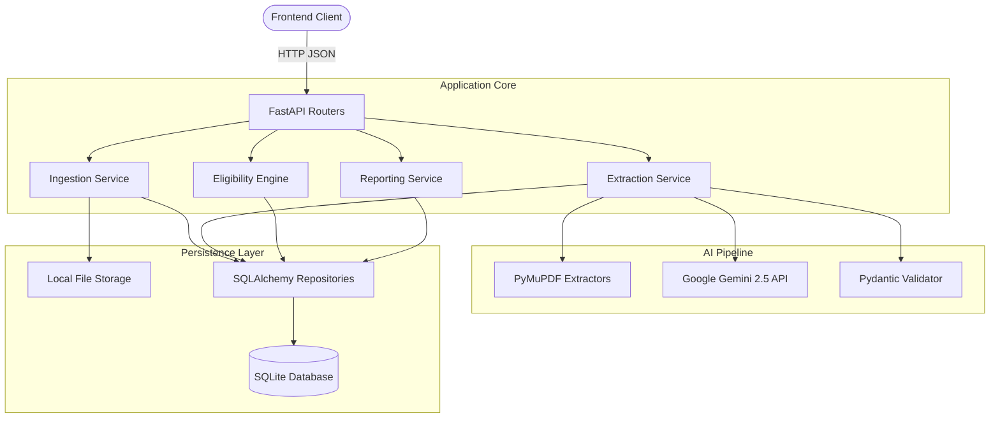

# SourceSure Backend

SourceSure is an automated AI-powered due diligence and supplier compliance pipeline built for evaluating complex multi-page supplier documents (certifications, audits, specs) against rigorous business requirements.

## 🏛️ System Architecture



### Key Modules

1. **Ingestion & Validation**: Safely handles, validates, and stores uploaded supplier documents (PDF, TXT).
2. **Extraction Pipeline (Background)**: Asynchronously chunks documents, prompts Gemini for structured fact extraction, and validates outputs rigorously using Pydantic, rejecting hallucinations.
3. **Eligibility Engine**: A deterministic rules engine that evaluates extracted `Evidence` against strict case `Requirements`, detecting conflicts and flagging low-confidence claims for human review.
4. **Reporting**: Aggregates the final compliance status (`PASS`/`FAIL`/`REVIEW`) and generates dynamic ranking scores based on customized weighting scenarios.

---

## 🚀 Setup Instructions

### Prerequisites
- **Python 3.12+**
- Gemini API Key

### 1. Installation

Clone the repository and navigate to the backend directory:

```bash
cd backend
python -m venv .venv

# Activate the virtual environment
# Windows:
.venv\Scripts\activate
# macOS/Linux:
source .venv/bin/activate

# Install dependencies
pip install -r requirements.txt
```

### 2. Environment Configuration

Create a `.env` file in the `backend` directory (a `.env.example` is provided):

```env
# Server
ENVIRONMENT=development

# LLM Config
LLM_API_KEY=your_gemini_api_key_here
LLM_MODEL=gemini-2.5-flash

# Limits
MAX_UPLOAD_MB=25
```

### 3. Initialize the Database

The system uses SQLAlchemy and Alembic for migrations.
```bash
alembic upgrade head
```

---

## 🏃 Running the Application

Start the FastAPI development server:

```bash
uvicorn app.main:app --reload
```
The API documentation (Swagger UI) will be available at `http://127.0.0.1:8000/docs`.

---

## 🧪 Testing & Evaluation

SourceSure features a comprehensive automated testing suite focusing on architectural integrity, extraction accuracy, and adversarial robustness.

### Integration & Unit Tests
Run the standard Pytest suite (includes the adversarial AI defense tests):

```bash
pytest tests/ -v
```

### Accuracy & ROI Evaluation Engine

SourceSure includes custom evaluation scripts to mathematically prove extraction precision and time savings.

**1. Run the Evaluation Engine (Accuracy & Precision):**
```bash
python evaluation/scripts/run_evaluation.py
```
*Generates an evaluation report in `evaluation/reports/eval_report.md` comparing database extractions against gold standard labels.*

**2. Run the ROI/Baseline Engine (Efficiency Gains):**
```bash
python evaluation/scripts/run_baseline.py
```
*Generates an ROI report in `evaluation/reports/time_savings_report.md` proving the automation speedup over manual human review.*
